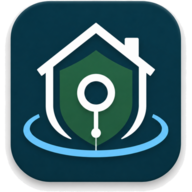

<div align="center">


<br>

[](https://github.com/the-vibe-dev/guardiannode/actions/workflows/test.yml)
[](https://the-vibe-dev.github.io/guardiannode/)
[](LICENSE)
[](https://github.com/the-vibe-dev/guardiannode/releases)

**Local-first, open-source AI safety monitor for families.**

[Documentation](https://the-vibe-dev.github.io/guardiannode/) ·
[Install guides](https://the-vibe-dev.github.io/guardiannode/PARENT_GUIDES/install-on-one-pc/) ·
[What it can't do](docs/PARENT_GUIDES/what-this-cannot-stop.md) ·
[Roadmap](docs/ROADMAP.md)

</div>

---

GuardianNode helps parents detect grooming, bullying, scams, explicit content, self-harm signals, and other digital-safety risks targeting their kids — without sending child data to the cloud, without raw keylogging, and without paying anyone.

- **Runs on your own PC.** No vendor account required.
- **Local AI.** Uses Ollama for text + vision classification on hardware you control.
- **Encrypted evidence.** Flagged snippets and screenshots are encrypted at rest with a key only you hold.
- **Open source.** Apache-2.0 licensed. Audit it, fork it, contribute to it.
- **Transparent.** Every alert explains *why* it was flagged — rules triggered, model confidence, evidence snippet.

> ⚠️ **GuardianNode is assistive software, not a replacement for parenting, professional support, or emergency services.** It will miss things. It will sometimes false-alarm. Use it as one of several tools, not as a finished solution.

---

## Two ways to deploy

### Shape A — All-in-one (one family PC)
Run agent + backend + Ollama + dashboard on a single Windows machine. The child's PC is also the parent's server. Backend is locked behind a parent password.

### Shape B — Separated (kid PC + parent server)
Child PC runs only the agent. A second PC (Windows or Linux, ideally with a GPU) runs the backend, Ollama, and dashboard. Child can't tamper with the backend; classification doesn't slow down gaming.

The child-device installer **auto-discovers** servers on your home network via mDNS — non-technical parents don't need to type IP addresses.

---

## System requirements

The installer probes your hardware and picks the strongest classifier tier it can run. You can re-tier later without reinstalling.

| Tier | Hardware needed | What runs | What it catches |
|---|---|---|---|
| **`full`** | NVIDIA GPU, 10+ GB VRAM (or two GPUs/endpoints) | Vision LLM + text LLM in parallel + rules engine | Everything below, with the most nuance on ambiguous chats |
| **`vision_only`** (default) | NVIDIA GPU, 6–12 GB VRAM | Vision LLM (OCR + image understanding) + rules engine | Explicit imagery, grooming/self-harm/scam text, custom watch phrases |
| **`text_only`** | No GPU, 8+ GB RAM | Tesseract OCR + small CPU LLM + rules engine | Text-based risks only — **visual-only risks (nudity/gore in images) are NOT detected** |

All tiers: Windows 10/11 64-bit on the child PC; the server side runs on Windows or Linux (Ubuntu/Debian/Fedora/Arch/openSUSE tested). Disk: ~2 GB for the app + 3–6 GB per AI model. A low-power family PC pairs well with **Shape B** — put the GPU in the server, not the kid's machine.

---

## Quick start

### Single-PC (Windows)

1. Download `GuardianNodeChildSetup.exe` from [Releases](https://github.com/the-vibe-dev/guardiannode/releases).
2. Run the installer; pick **"Install everything on this PC"**.
3. The installer detects your hardware, recommends an AI model size, and pulls it automatically (5–20 minutes on first install).
4. When it finishes, the dashboard opens at `http://127.0.0.1:8787`. Create your parent password there and **write down the 12-word recovery code** (you'll need it if you forget the password).
5. The monitoring agent pairs with the local server automatically — check the Devices page to confirm it's online.

### Separated (Linux server + Windows kid PC)

On the server:
```bash
curl -fsSL https://raw.githubusercontent.com/the-vibe-dev/guardiannode/main/installer/server-linux/install.sh | sudo bash
```
Or with Docker:
```bash
git clone https://github.com/the-vibe-dev/guardiannode.git
cd guardiannode/installer/server-linux
docker compose up -d
```
Open `http://<server-ip>:8787/setup` to finish admin account setup and pull models.

On the kid PC: first open your parent dashboard → **Devices → Add device** to get a 6-digit pairing code. Then run `GuardianNodeChildSetup.exe` on the child's PC, pick **"Connect to existing server"**, and enter the code (leave the server URL blank to find the server on your network automatically).

---

## What it watches

By default, GuardianNode reviews the visible screen in the signed-in Windows
session. The monitored-app list is kept as context for app/window names, not as
the capture gate, so plain apps such as Notepad are covered too.

What it captures:
- Visible on-screen text from screenshots, read by OCR and/or the local vision model
- App and window titles for context
- Screenshots of the visible desktop. Raw bytes are stored, encrypted at rest,
  only for events flagged as risky

What it does **not** do:
- No system-wide raw keystroke capture
- No password-field collection
- No cloud upload of child data
- No stealth/spyware behavior — there's a visible tray icon and the child can see when monitoring is active

See [`docs/SAFETY_BOUNDARIES.md`](docs/SAFETY_BOUNDARIES.md) for the full ethical/technical scope statement.

---

## Risk categories detected

| Severity | Examples |
|---|---|
| **Critical** | Imminent self-harm, credible threats, sexual exploitation/grooming, child sharing home address/school/phone with stranger |
| **High** | Off-platform contact request, secrecy/coercion, bullying escalation, phishing, Robux/gift-card scams, gore imagery |
| **Medium** | Profanity, age/location questions, unknown links, drug/alcohol references, weapons imagery |
| **Low** | Mild conflict, gaming trash talk, unclear suspicious context |

The full taxonomy is documented in [`docs/CLASSIFIER.md`](docs/CLASSIFIER.md) and honored by the LLM prompts in [`backend/app/prompts/`](backend/app/prompts/) and the rules engine in [`backend/app/services/risk_rules.py`](backend/app/services/risk_rules.py).

---

## Documentation

**Browse everything at [the-vibe-dev.github.io/guardiannode](https://the-vibe-dev.github.io/guardiannode/)** — the same guides as below, searchable and readable on a phone.

For parents:
- [Install on one PC](docs/PARENT_GUIDES/install-on-one-pc.md)
- [Install on a server + child PC](docs/PARENT_GUIDES/install-server-and-child.md)
- [When Windows says "Protected your PC"](docs/PARENT_GUIDES/when-windows-says-protected-your-pc.md) — SmartScreen click-through
- [If you forget your password](docs/PARENT_GUIDES/if-you-forget-your-password.md)
- [Pause monitoring when you use the PC](docs/PARENT_GUIDES/pause-monitoring-when-you-use-the-pc.md)
- [What this cannot stop](docs/PARENT_GUIDES/what-this-cannot-stop.md) — honest limits
- [Move server to another PC](docs/PARENT_GUIDES/move-server-to-another-pc.md)
- [Troubleshooting](docs/PARENT_GUIDES/troubleshooting.md)

For developers:
- [Architecture](docs/ARCHITECTURE.md)
- [Backend setup](docs/BACKEND_SETUP.md)
- [Windows agent](docs/AGENT_WINDOWS.md)
- [Dashboard](docs/DASHBOARD.md)
- [Power-user/source install](docs/POWER_USER_INSTALL.md)
- [OCR pipeline](docs/OCR.md)
- [Image safety](docs/IMAGE_SAFETY.md)
- [Text classifier](docs/CLASSIFIER.md)
- [Redaction rules](docs/REDACTION.md)
- [Device pairing](docs/DEVICE_PAIRING.md)
- [Retention policy](docs/RETENTION.md)
- [Notifications](docs/NOTIFICATIONS.md)
- [Enforcement](docs/ENFORCEMENT.md)
- [Installer architecture](docs/INSTALLER_ARCHITECTURE.md)
- [Roadmap](docs/ROADMAP.md)

---

## Contributing

GuardianNode exists to help families. Contributions are welcome — especially:
- New risk categories or rules
- Better OCR region configs for specific apps/games
- Translations
- Bug reports from real deployments

See [CONTRIBUTING.md](CONTRIBUTING.md) and the [Code of Conduct](CODE_OF_CONDUCT.md).

---

## Security

Found a security issue? Please see [SECURITY.md](SECURITY.md) for responsible disclosure. Do **not** open public issues for exploitable vulnerabilities.

## Privacy

See [PRIVACY.md](PRIVACY.md). Short version: GuardianNode does not phone home, does not call third-party APIs, and stores all evidence encrypted on machines you control.

## License

Apache-2.0. See [LICENSE](LICENSE). Bundled third-party components are listed in [THIRD_PARTY_NOTICES.md](THIRD_PARTY_NOTICES.md); Ollama model licenses are in [MODEL_LICENSES.md](MODEL_LICENSES.md).

## Brand

Logos, icons, the color palette, and usage guidance live in [`assets/brand/`](assets/brand/).

---

<div align="center">
<br>
<sub><strong>Protecting Families, Privately.</strong></sub>
</div>
