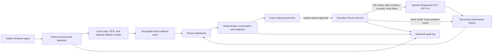

<div align="center">


<br>

[](https://github.com/the-vibe-dev/guardiannode/actions/workflows/test.yml)
[](https://the-vibe-dev.github.io/guardiannode/)
[](LICENSE)
[](https://github.com/the-vibe-dev/guardiannode/releases)

# GuardianNode Alpha / Developer Preview

**Local-first AI safety monitoring for families.**

[Documentation](https://the-vibe-dev.github.io/guardiannode/) ·
[Install guides](https://the-vibe-dev.github.io/guardiannode/PARENT_GUIDES/install-on-one-pc/) ·
[Known limitations](KNOWN_LIMITATIONS.md) ·
[Release checklist](RELEASE_CHECKLIST.md) ·
[Support development](docs/SUPPORT.md)

</div>

GuardianNode is an early local-first AI safety monitor for families. It helps
parents review risk signals from a child's Windows device using local
screenshots/OCR/vision/text classification, a local backend, Ollama model
support, encrypted evidence storage, and a parent dashboard.

- Local-first by default
- Parent-owned backend
- Ollama model support
- Screenshot/OCR/vision/text safety pipeline
- Encrypted local evidence storage
- Parent review dashboard
- No cloud account required
- No subscription required
- No raw keylogging
- AGPL-3.0 open source

> **Alpha status**
>
> GuardianNode is alpha software. It may miss risks, create false positives,
> break during setup, or consume significant system resources. Do not rely on it
> as the only child-safety measure. It is not an emergency service and is not a
> substitute for parenting, communication, or professional support.
>
> **Supported in this alpha:** Windows 11 installer testing and source-code
> evaluation by technical parents, developers, early evaluators, and safety
> reviewers. This is not a finished consumer product for ordinary non-technical
> families. Do not expose GuardianNode directly to the public internet.

GuardianNode is for parents and guardians monitoring devices they own or
administer for their own children. It is not stealthware, employee monitoring
software, a keylogger, or a tool for credential theft. The Windows agent is
visible through its tray/status UI and the backend is operated by the parent.

## Build Week 2026

### What GuardianNode is

GuardianNode is the existing local-first foundation described above: a visible
Windows agent, parent-owned backend, local detection pipeline, encrypted
evidence store, and parent dashboard. It creates reviewable safety signals while
keeping normal operation local and under the parent's control.

### What Guardian Review adds

Guardian Review is the Build Week optional second opinion for an existing local
alert. A parent can add context, inspect the exact
locally minimized/redacted JSON proposed for transmission, consent to that one
request, and receive a strict structured assessment with uncertainty,
conversation guidance, actions, escalation indicators, and limitations.

The backend service, durable worker, strict schema, direct OpenAI Responses API
integration, and synthetic harness were implemented on July 14. The alert page
then gained guided minimization controls, an exact read-only outbound preview,
explicit consent and cancel actions, a complete communication plan, local
review history/deletion, and versioned parent feedback. Six resettable judge
scenarios and a 55-case evaluation set use synthetic data only. Guardian Review
does not silently upload screenshots or directly drive enforcement.

### Existing-project disclosure

The last verified repository state before the official Build Week cutoff is
commit `36b2a547056d40eff32f00aa59b7820f7d3e98d5`, protected by tag
`pre-build-week-2026`. Build Week work is isolated on
`build-week/guardian-review` and the July 15 continuation
`build-week/guardian-review-privacy`. The pre-existing project includes the agent,
backend, dashboard, local detection, encrypted evidence, installers,
authentication/security controls, and 353 passing unique tests.

The repository owner describes the existing dashboard/visual UI as
Claude-assisted and the existing agent, backend, security, installer, and
platform hardening as Codex-built. Git metadata cannot independently verify the
complete historical split. See the [baseline evidence](docs/build-week/BASELINE.md)
and the [Build Week comparison](https://github.com/the-vibe-dev/guardiannode/compare/pre-build-week-2026...main).

### How Codex is being used

Codex is being used to preserve and audit the baseline, trace the actual
application flow, run verification, define the Guardian Review schema/privacy
contract, and implement reviewed Build Week changes. No production child data
is used for this collaboration. Details are recorded in the
[collaboration log](docs/build-week/CODEX_COLLABORATION.md).

GPT-5.6-powered Codex accelerated repository analysis, implementation, testing,
adversarial review, and submission preparation. Human decisions remained
explicit: cloud review is optional, consent is bound to the exact preview,
feedback remains local, model output cannot punish or diagnose, and the
coding-agent provider was disabled when its tool boundary proved unsuitable.

### How GPT-5.6 is used at runtime

Live Guardian Review uses the server-side OpenAI Responses API, defaults to the
configurable `gpt-5.6` alias, sets `store: false`, supplies no tools, and accepts
only strict schema `1.1.0` output. Deterministic redaction contract
`guardian-review-redaction-v3` and the parent's consent are bound to the exact
outbound preview. `store: false` is not described as a zero-retention guarantee;
live direct-API mode also fails closed unless the operator confirms the project
has approved Zero Data Retention controls.

An experimental “Sign in with ChatGPT” Codex transport was tested using only
synthetic data. The July 18 security review found that a coding agent's local
tools create the wrong capability boundary for family incident evidence, so
that transport is disabled pending enforceable zero-tool isolation. Mock mode
and all local detection remain functional without a live provider.
See the [technical specification](docs/build-week/GUARDIAN_REVIEW_SPEC.md)
and [privacy model](docs/build-week/PRIVACY_MODEL.md). Reproducible evidence is
in the [evaluation results](docs/build-week/EVALUATION_RESULTS.md),
[Build Week changelog](docs/build-week/CHANGELOG.md), and
[Codex collaboration record](docs/build-week/CODEX_COLLABORATION.md).

### Architecture and privacy flow



Local detection and evidence persistence happen before Guardian Review and do
not depend on an external provider. Screenshots remain local. Only the exact
minimized JSON shown in the preview is eligible for a live request, and a
cancel action sends nothing. See the full [data-flow and privacy model](docs/build-week/PRIVACY_MODEL.md).

### Demo mode

Use the Windows 11 installer path below for a technical-parent alpha setup, or
use the source instructions for development. The current demonstrable path is:

1. Start the local backend, complete parent setup, and enable demo mode.
2. Open **Synthetic demo** and confirm the demo device and provider status.
3. Choose one of six labeled synthetic scenarios and trigger its local event.
4. Open the generated incident and review the local detector reasoning.
5. Choose optional context/evidence, inspect the exact outbound JSON, and either
   cancel or explicitly consent.
6. View the structured assessment and communication plan, record local parent
   feedback, then reset the synthetic demo.

For the implemented synthetic backend demonstration:

```bash
cd backend
python -m app.guardian_review_harness --provider mock --scenario unknown-contact
```

For the guided judge path, set `GUARDIANNODE_DEMO_MODE_ENABLED=true` and use the
dashboard's **Synthetic demo** page. Mock mode needs no key. Live mode is an
advanced server configuration; no API key is committed or exposed to the
browser. The coding-agent/ChatGPT subscription transport is intentionally on a
security hold as described above.

See [Guardian Review configuration](docs/build-week/CONFIGURATION.md) and
[judge troubleshooting](docs/build-week/TROUBLESHOOTING.md). Submission copy
and the functional 2:48 shot plan are in the
[Devpost draft](docs/build-week/DEVPOST_DRAFT.md) and
[video script](docs/build-week/VIDEO_SCRIPT.md). The
[synthetic screenshot gallery](docs/build-week/screenshots/README.md) was
captured from the real disposable mock workflow, not a design mockup.

The recording package includes the [2:48 script](docs/build-week/VIDEO_SCRIPT.md),
[Codex computer prompt](docs/build-week/video/CODEX_COMPUTER_PROMPT.md),
[production runbook](docs/build-week/video/VIDEO_PRODUCTION_RUNBOOK.md), captions,
voiceover, and a machine-readable shot manifest.

### Live mode

Live mode is an advanced backend-only configuration. It requires an OpenAI API
project explicitly approved for the operator's required retention controls, a
server-side key, and deliberate enablement. The browser never receives the key.
See [Guardian Review configuration](docs/build-week/CONFIGURATION.md). The
ChatGPT/Codex subscription transport is intentionally unavailable in this
candidate; it is not a parent-friendly replacement for the direct API yet.

### Tests and evaluation

The latest practical Linux source run recorded 412 unique passing automated
tests: 276 backend/E2E, 59 Windows-agent unit tests, 58 release/control tests,
and 19 dashboard tests. Lint, type checks, production builds, dependency audits,
repository controls, a 196-case rules benchmark, strict documentation build,
and tracked-history secret scanning also passed. See the exact commands and
environment in the [July 19 report](docs/build-week/DAILY_2026-07-19.md).

The 55-case Guardian Review evaluation is wholly synthetic and checks explicit
properties. Mock mode achieved 55/55 schema-compliant completions but only
45.45% assessment-category agreement, which is disclosed rather than presented
as model accuracy. See [evaluation results](docs/build-week/EVALUATION_RESULTS.md).

### Supported platforms and limitations

GuardianNode is alpha software, can miss or overstate risks, and can capture
sensitive visible content. Windows 11 x64 is the promoted child-device path;
Windows 10 has not been promoted. Installers are unsigned, separated deployments
need a trusted VPN/TLS design, and Guardian Review remains a fallible second
opinion rather than an emergency or diagnostic service. Deterministic
redaction is defense-in-depth rather than a guarantee: unusual international
addresses, novel obfuscation, image-only private data, or relevant URL domains
can still carry identifying context. The 55-case synthetic evaluation measures
explicit properties, not clinical or universal accuracy. Windows clean-install,
reboot, uninstall, and reinstall qualification must be completed on the signed
release candidate before general beta promotion. See [Known limitations](KNOWN_LIMITATIONS.md),
the [evaluation results](docs/build-week/EVALUATION_RESULTS.md), and the
[submission checklist](docs/build-week/SUBMISSION_CHECKLIST.md).

### Build Week commits and evidence

- Baseline tag: [`pre-build-week-2026`](https://github.com/the-vibe-dev/guardiannode/tree/pre-build-week-2026)
- Baseline-to-current comparison: [Build Week diff](https://github.com/the-vibe-dev/guardiannode/compare/pre-build-week-2026...main)
- Evidence index: [Build Week 2026](BUILD_WEEK.md)
- Daily reports: [July 14](docs/build-week/DAILY_2026-07-14.md),
  [July 15](docs/build-week/DAILY_2026-07-15.md),
  [July 16](docs/build-week/DAILY_2026-07-16.md),
  [July 17](docs/build-week/DAILY_2026-07-17.md),
  [July 18](docs/build-week/DAILY_2026-07-18.md),
  [July 19](docs/build-week/DAILY_2026-07-19.md),
  [July 20](docs/build-week/DAILY_2026-07-20.md), and
  [July 21](docs/build-week/DAILY_2026-07-21.md)

## Deployment Shapes

### All-in-one

Run the Windows agent, backend, dashboard, and Ollama on one family PC. In this
alpha, the Windows 11 all-in-one installer is a supported public-alpha path for
technical parents. For source-code testing, this is the simplest recommended
shape. The backend should stay bound to loopback.

### Separated

Run the Windows child-device agent on the child's PC and run the backend,
dashboard, and Ollama on a parent-owned Windows or Linux server. This is an
advanced operator path only and must use a trusted VPN/TLS setup. Do not expose
the backend directly on a raw LAN or the public internet. Built-in TLS/mTLS is
planned. See [Secure LAN setup](docs/SECURE_LAN_SETUP.md).

## What It Monitors

GuardianNode reviews visible screen content from the configured Windows session.
Current installer defaults enable visible desktop screenshot capture so parents
should assume screenshots may contain sensitive on-screen content. Depending on
policy/settings, deployments may use full-screen captures or capture only when
configured apps are active.

GuardianNode can process:

- Visible screen/app activity from configured Windows sessions
- OCR text from screenshots
- Vision model analysis of screenshots/images
- Visible browser and application content captured on screen, plus application
  and window context. This alpha does not include a browser DOM extension or
  direct third-party message collector.
- Risk categories such as grooming, off-platform contact attempts, bullying,
  self-harm language, explicit/sexual content, gore/violence, scams/phishing,
  suspicious links, and private-info sharing

Parents should configure capture scope and retention carefully. Evidence is for
parent/admin review and may include private messages, screenshots, names, URLs,
or other sensitive material visible on the child device.

## What It Does Not Do

- Does not perform raw system-wide keylogging
- Does not secretly install itself
- Does not send child data to a GuardianNode cloud
- Cannot detect every risk
- Does not replace platform parental controls
- Does not replace emergency intervention

GuardianNode may apply basic text filtering/redaction in some ingest paths, but
parents should assume captured evidence can contain sensitive on-screen
information. Evidence is stored locally and encrypted for parent/admin review.
Guardian Review is disabled by default and never sends a live request until a
parent sees the exact minimized JSON, acknowledges external OpenAI processing,
and explicitly continues. Full screenshots, local file paths, device names, and
unselected context remain local.

## System Requirements

Windows 11 64-bit is the promoted alpha child-device target. Windows 10 remains
an unpromoted source/qualification target. The server side runs on Windows or
Linux. Ollama model performance depends heavily on CPU/GPU/RAM.

| Tier | Hardware | What it catches |
|---|---|---|
| `vision_only` | NVIDIA GPU, 12-15 GB VRAM | Screenshots/images plus OCR/text risk signals in one vision pass |
| `text_only` | No GPU or under 12 GB VRAM, 8+ GB RAM recommended | OCR/text risks only; visual-only content may be missed |
| `full` | NVIDIA GPU, 16+ GB VRAM or split endpoints | Vision plus separate text model kept available |

Model choices are suggestions. GuardianNode does not bundle model weights; users
must review the license and performance of any Ollama model they install. See
[MODEL_LICENSES.md](MODEL_LICENSES.md).

## Quick Start

### Alpha Support Matrix

| Mode | Alpha support |
|---|---|
| Windows 11 all-in-one installer | Supported public alpha path for technical parents |
| Windows 11 server installer | Supported public alpha path for parent-owned server PCs |
| Windows 11 child-only installer | Supported public alpha path when paired to a trusted parent server |
| Source backend on loopback | Supported for technical evaluation |
| Source all-in-one Windows evaluation | Supported for technical evaluation |
| Separated private LAN/VPN deployment | Advanced alpha path; explicit opt-in, trusted LAN/VPN/TLS required |
| Public Internet exposure | Unsupported |

### Prerequisites

- Python 3.12
- Node.js 24
- npm with `npm ci`
- Ollama for model-backed classification
- Linux, macOS, or Windows for backend/dashboard development
- Windows 11 for the promoted source-agent path; Windows 10 only for explicit
  qualification testing

### Windows 11 Installer Alpha

The public alpha can include unsigned Windows x64-compatible installers:

- `GuardianNodeChildSetup-0.1.0-alpha.2.exe`
- `GuardianNodeServerSetup-0.1.0-alpha.2.exe`

The child installer supports all-in-one mode and child-only pairing mode. The
server installer installs the parent backend/dashboard and can stay local-only
or explicitly enable private LAN/VPN child-PC access. Admin rights are required.
Unsigned alpha installers may trigger SmartScreen, Defender, or antivirus
warnings; verify the release checksums before running them.

Start with:

- [Install on one PC](docs/PARENT_GUIDES/install-on-one-pc.md)
- [Install a server + child PC](docs/PARENT_GUIDES/install-server-and-child.md)
- [When Windows says "Protected your PC"](docs/PARENT_GUIDES/when-windows-says-protected-your-pc.md)
- [Troubleshooting and uninstall](docs/PARENT_GUIDES/troubleshooting.md)

### Backend From Source

Run the backend bound to loopback for technical evaluation:

```bash
git clone https://github.com/the-vibe-dev/guardiannode.git
cd guardiannode
python -m venv .venv
. .venv/bin/activate
python -m pip install --upgrade pip
pip install -e "backend[dev]"
mkdir -p local_config/dev-data
cat > local_config/dev.env <<'EOF'
GUARDIANNODE_BIND_HOST=127.0.0.1
GUARDIANNODE_BIND_PORT=8787
GUARDIANNODE_DATA_DIR=local_config/dev-data
GUARDIANNODE_ALLOWED_HOSTS=127.0.0.1,localhost,testserver
GUARDIANNODE_MDNS_ENABLED=false
GUARDIANNODE_CLASSIFIER_TIER=text_only
GUARDIANNODE_TEXT_MODEL=
GUARDIANNODE_VISION_MODEL=
EOF
set -a
. local_config/dev.env
set +a
uvicorn app.main:app --app-dir backend --host 127.0.0.1 --port 8787
```

In another terminal after the backend starts, print the one-time setup token:

```bash
python - <<'PY'
import json
from pathlib import Path

path = Path("local_config/dev-data/keys/setup_token.json")
print(json.loads(path.read_text(encoding="utf-8"))["token"])
PY
```

For Windows source testing, the equivalent PowerShell command is:

```powershell
(Get-Content .\local_config\dev-data\keys\setup_token.json | ConvertFrom-Json).token
```

Open `http://127.0.0.1:8787/setup`, paste this one-time token, create the
parent account, and save the recovery code. Do not post the setup token in an
issue or chat. Back up the backend data directory, especially the evidence
encryption key material.

### Dashboard From Source

The backend serves the committed dashboard bundle from `backend/app/static`.
For dashboard development or to refresh that bundle:

```bash
cd dashboard
npm ci
npm run typecheck
npm test -- --run
npm run build
```

### Windows Agent Development From Source

Use a test Windows session and a loopback backend when you want to develop or
debug the agent directly instead of using the public alpha installer:

```powershell
cd agent-windows
py -3.12 -m venv .venv
.\.venv\Scripts\Activate.ps1
python -m pip install --upgrade pip
pip install -e ".[dev,windows]"
pytest

# In the dashboard, create a child profile, open Devices, choose Add device,
# and copy the six-digit pairing code. Replace 123456 with that code.
python -m src.main --pair --server http://127.0.0.1:8787 --code 123456

# Validate capture without sending events.
python -m src.main --dry-run

# Run the source agent normally after validation.
python -m src.main
```

Create and assign the child profile in the dashboard before relying on age
policy behavior. Do not send parent passwords over plaintext LAN HTTP.

### Public Alpha Installer Paths

Windows 11 child/all-in-one and parent-server installers are supported
public-alpha artifacts for technical parents and early evaluators. They remain
unsigned alpha installers, so verify the release checksums before running them
and expect SmartScreen/Defender reputation warnings.

For Linux server installs, prefer downloading the tagged installer bundle or
script, verifying the published checksum or signature, reviewing it locally,
then executing it with `sudo`. Do not pipe an unverified network response
directly into a privileged shell.

For Docker testing, clone the tagged source, review the Compose files, and run
the deployment only on a trusted host. Do not expose the backend directly to the
public internet during alpha testing.

## Evidence Encryption And Recovery

GuardianNode encrypts retained screenshot blobs and collected event text with
AES-256-GCM. On new Windows installations, the 32-byte backend master key is
wrapped with Windows DPAPI in LocalMachine scope and stored as
`keys/master.key.dpapi`. On Linux, macOS, and source deployments outside
Windows, the current alpha stores `keys/master.key` with restrictive filesystem
permissions. Upgraded Windows installations may retain a legacy raw key after
generating a DPAPI-wrapped copy; verify a portable backup before removing the
legacy file. DPAPI LocalMachine protects against casual file copying but is not
a boundary against a sufficiently privileged process on that machine.

Create a portable, passphrase-encrypted key backup from the backend environment:

```bash
cd backend
python -m app.services.encryption export-key-backup /safe/path/guardiannode-master-key-backup.json
```

Restore it when moving or recovering the backend:

```bash
cd backend
python -m app.services.encryption import-key-backup /safe/path/guardiannode-master-key-backup.json
```

The 12-word recovery code resets the parent dashboard account only. It cannot
decrypt evidence and does not replace a master-key backup.

## Documentation

For parents:

- [Install on one PC](docs/PARENT_GUIDES/install-on-one-pc.md)
- [Install on a server + child PC](docs/PARENT_GUIDES/install-server-and-child.md)
- [Privacy & alert settings](docs/PARENT_GUIDES/privacy-and-alert-settings.md)
- [When Windows says "Protected your PC"](docs/PARENT_GUIDES/when-windows-says-protected-your-pc.md)
- [Known limitations](KNOWN_LIMITATIONS.md)
- [What this cannot stop](docs/PARENT_GUIDES/what-this-cannot-stop.md)

For developers:

- [Architecture](docs/ARCHITECTURE.md)
- [Backend setup](docs/BACKEND_SETUP.md)
- [Windows agent](docs/AGENT_WINDOWS.md)
- [Dashboard](docs/DASHBOARD.md)
- [Secure LAN setup](docs/SECURE_LAN_SETUP.md)
- [Roadmap](docs/ROADMAP.md)
- [Launch messaging](docs/LAUNCH_MESSAGING.md)
- [Release checklist](RELEASE_CHECKLIST.md)

## Support Development

GuardianNode is AGPL-3.0 open-source software with no cloud account or
subscription required. Donations can help fund test hardware, installer signing,
documentation, and platform work. See [Support development](docs/SUPPORT.md).

## Security And Privacy

Read [SECURITY.md](SECURITY.md) and [PRIVACY.md](PRIVACY.md) before using
GuardianNode with real family data. Do not upload child screenshots, private
messages, logs containing personal information, or evidence exports to public
GitHub issues.

## License

GuardianNode is licensed under the GNU Affero General Public License v3.0. See
[LICENSE](LICENSE). Commercial licensing may be available separately; see
[COMMERCIAL-LICENSE.md](COMMERCIAL-LICENSE.md).

Bundled third-party components are listed in
[THIRD_PARTY_NOTICES.md](THIRD_PARTY_NOTICES.md). Ollama model guidance is in
[MODEL_LICENSES.md](MODEL_LICENSES.md).
