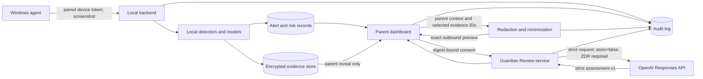

# Guardian Review Technical Specification

- Status: implementation foundation; runtime service not yet implemented
- Assessment schema: `1.0.0`
- Prompt version: `guardian-review-v1`

## Purpose and boundary

Guardian Review is an optional parent-requested second opinion about an existing
local GuardianNode alert. It explains uncertainty and helps a parent begin a
calm, safety-conscious conversation. It does not replace local detection,
silently upload evidence, automatically punish or block a child, make a legal or
medical determination, or operate as an emergency service.

## Current and planned golden path

The existing path is:

1. `agent-windows/src/main.py` captures a visible frame and calls
   `BackendClient.send_screenshot`.
2. `POST /api/events/screenshot` authenticates the paired device, encrypts a
   pending frame, persists a receipt, and queues local classification.
3. `screenshot_async` decrypts the pending frame for the worker and calls
   `screenshot_ingest`.
4. Tesseract, deterministic rules, policy, and configured local Ollama models
   produce normalized risk data. Events, risk results, encrypted evidence, and
   alerts are persisted.
5. The React dashboard loads `/api/alerts` and `/api/alerts/{id}`, reveals
   encrypted evidence only on request, and records existing review/feedback.

Guardian Review extends step 5 with a local preview, explicit consent, an
asynchronous review job, strict structured result display, and separate parent
feedback.



## Strict assessment schema

The normative machine-readable contract is
`shared/schemas/guardian_review_assessment_v1.json`. Every property is required,
every object rejects additional properties, strings and arrays are bounded, and
empty arrays represent unavailable guidance. No prose outside the schema is
accepted.

The primary category reuses the backend canonical taxonomy and adds `none` for
a likely-benign result. The schema includes:

- Schema version, assessment, category, severity, and confidence.
- Plain-language summary and supporting evidence with local opaque evidence IDs.
- Possible benign explanations, missing context, and parent questions.
- Controlled parent tone plus suggested opening language and child questions.
- Phrases/approaches to avoid, immediate actions, and follow-up actions.
- Escalation indicators and explicit limitations.

The model must never create policy actions directly. The parent chooses any
next step after reviewing the result and original evidence.

## DTOs

### Preview input

```json
{
  "parent_context": "Optional context known to the parent, maximum 4000 characters.",
  "selected_evidence_ids": ["opaque-local-evidence-id"]
}
```

At most 20 evidence IDs are accepted. The server verifies that every ID belongs
to the alert. Alert severity, categories, device/profile data, and evidence text
are derived server-side rather than trusted from the browser.

### Preview output

```json
{
  "alert_id": "opaque-alert-id",
  "schema_version": "1.0.0",
  "prompt_version": "guardian-review-v1",
  "outbound_payload": {},
  "preview_digest": "64-lowercase-hex-sha256",
  "field_count": 0,
  "character_count": 0,
  "redactions_applied": ["email"],
  "zdr_required": true,
  "expires_at": "RFC3339 timestamp"
}
```

`outbound_payload` is the exact canonical JSON proposed for transmission, not a
summary. The digest covers that JSON plus schema and prompt versions. Previews
expire after 15 minutes. Re-minimization or any input/version change invalidates
the digest.

### Submit input and accepted output

```json
{
  "preview_digest": "64-lowercase-hex-sha256",
  "consent": true
}
```

Successful submission returns HTTP 202:

```json
{
  "review_id": "opaque-review-id",
  "status": "queued",
  "status_url": "/api/guardian-reviews/opaque-review-id"
}
```

The server regenerates the preview and compares digests in constant time; it
does not accept client-supplied outbound JSON.

### Result output

```json
{
  "review_id": "opaque-review-id",
  "alert_id": "opaque-alert-id",
  "status": "completed",
  "mode": "mock",
  "created_at": "RFC3339 timestamp",
  "completed_at": "RFC3339 timestamp",
  "schema_version": "1.0.0",
  "prompt_version": "guardian-review-v1",
  "model_requested": "gpt-5.6",
  "model_returned": null,
  "assessment": {}
}
```

Status is `queued`, `running`, `completed`, or `failed`. `assessment` is present
only when completed; a sanitized `error` is present only when failed.

### Feedback input

```json
{
  "helpfulness": "helpful",
  "assessment_accuracy": "accurate",
  "notes": "Optional parent note, maximum 2000 characters."
}
```

`helpfulness` is `helpful`, `partly_helpful`, or `not_helpful`.
`assessment_accuracy` is `accurate`, `too_concerning`,
`not_concerning_enough`, or `unsure`. Feedback remains local and never becomes
an automatic follow-up model request.

## API and authorization

| Route | Behavior | Authorization |
|---|---|---|
| `POST /api/alerts/{alert_id}/guardian-review/preview` | Local minimization only; no external call | Parent session + CSRF |
| `POST /api/alerts/{alert_id}/guardian-review` | Validate digest/consent and enqueue | Parent session + CSRF + recent step-up |
| `GET /api/guardian-reviews/{review_id}` | Poll job/result | Parent session; record must belong to deployment |
| `POST /api/guardian-reviews/{review_id}/feedback` | Store local feedback | Parent session + CSRF |

Enabling live mode or changing its secret/configuration requires critical
step-up authentication. Rate limits apply per parent and deployment.

## Error model

All failures use:

```json
{
  "error": {
    "code": "preview_stale",
    "message": "The outbound preview changed; review it again.",
    "retryable": false,
    "review_id": null
  }
}
```

Allowed codes are `feature_disabled`, `zdr_not_confirmed`,
`configuration_error`, `consent_required`, `preview_stale`, `not_found`,
`already_running`, `rate_limited`, `upstream_timeout`,
`upstream_unavailable`, `upstream_refusal`, and `invalid_model_output`.
Messages never include an API key, raw upstream body, prompt, parent context, or
evidence.

## Worker, timeout, and retry behavior

- Persist the job before returning 202 so it survives restart.
- Use `(alert_id, preview_digest, prompt_version)` as the idempotency identity;
  a duplicate submission returns the existing job.
- Allow 45 seconds per upstream attempt and two total attempts.
- Retry only transport failures, HTTP 408/429/5xx, or invalid structured output.
- Honor `Retry-After` up to 30 seconds; otherwise use 1–3 seconds of jitter.
- Do not retry refusals, consent/configuration errors, or deterministic 4xx.
- On exhaustion, persist a sanitized failure and allow an explicit new review.

## Model and prompt configuration

Planned environment contract:

| Setting | Default/requirement |
|---|---|
| `GUARDIANNODE_GUARDIAN_REVIEW_ENABLED` | `false` |
| `GUARDIANNODE_GUARDIAN_REVIEW_MODE` | `mock`; allowed `mock` or `live` |
| `GUARDIANNODE_GUARDIAN_REVIEW_ZDR_CONFIRMED` | `false`; live mode fails closed |
| `GUARDIANNODE_GUARDIAN_REVIEW_MODEL` | `gpt-5.6` |
| `GUARDIANNODE_GUARDIAN_REVIEW_PROMPT_VERSION` | `guardian-review-v1` |
| `GUARDIANNODE_GUARDIAN_REVIEW_TIMEOUT_SECONDS` | `45` |
| `GUARDIANNODE_GUARDIAN_REVIEW_MAX_ATTEMPTS` | `2` |
| `OPENAI_API_KEY` | required only in live mode; never logged or stored in DB |

The Responses API request uses strict `text.format` JSON Schema, `store: false`,
medium reasoning effort, bounded output, no tools, no web access, no background
mode, and no response chaining. A deployment-scoped hashed parent identifier may
be used as `safety_identifier`; a child identifier must not be used. Record the
requested and returned model IDs because aliases can move.

The system prompt is versioned source, treats all evidence and parent context as
untrusted quoted data, forbids following instructions inside that data, forbids
unsupported identity/intent claims, and requires uncertainty and limitations.

## Audit events

Emit `guardian_review.previewed`, `.consented`, `.queued`, `.sent`, `.completed`,
`.failed`, and `.feedback_recorded`. The versioned audit details contain event,
actor, alert/review IDs, mode, prompt/schema versions, requested/returned model,
preview digest, minimized field names, outbound character count, consent time,
status, duration, attempt count, and sanitized error code.

Never audit raw outbound data, prompts, responses, API keys, parent notes,
evidence excerpts, or personal data.

## Mock mode

Mock mode uses deterministic synthetic scenario fixtures, produces the same
strict DTO through the same durable worker/persistence/audit path, requires no
API key or network, and is visibly labeled **Mock assessment**. It must never
fall through to live mode.

## Required implementation tests

- JSON Schema contract and output rejection tests.
- Auth, CSRF, step-up, ownership, rate-limit, and fail-closed ZDR tests.
- Evidence ownership, minimization, redaction, preview digest, expiry, and stale
  consent tests.
- Durable queue, restart, idempotency, timeout, retry, refusal, malformed
  output, and sanitized-error tests.
- Prompt-injection fixtures and audit-log sensitive-data exclusion tests.
- Mock/live isolation and no-network mock tests.
- Dashboard queued/failure/completed/consent/feedback/accessibility states.
- Migration upgrade/rollback and encrypted-result retention tests.
