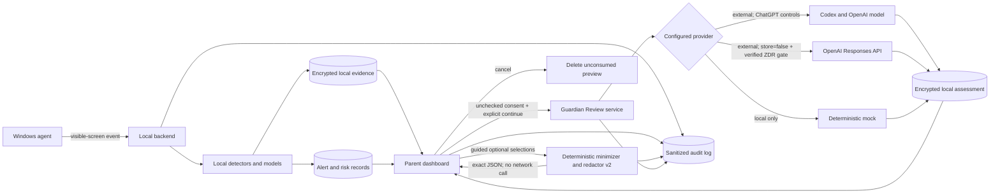

# Guardian Review Privacy Model

## Principles

Guardian Review is local-first, parent-initiated, data-minimized, and disabled
by default. Local detection decides that an alert exists. A cloud assessment is
never automatic, never required to view the alert, and never permitted merely
because the parent opened the page.

## Data flow and minimization

The local backend constructs an allowlisted DTO from an existing alert and
parent-selected evidence. It does not send a screenshot or arbitrary database
record. Before preview it applies existing redaction plus Guardian Review rules:

- Remove child/parent names, usernames, handles, email addresses, phone numbers,
  street addresses, account identifiers, tokens, and credentials.
- Remove URLs/query strings, IP addresses, precise device/profile IDs, source
  paths, exact window titles, school names, and other custom watch values.
- Replace age with the existing coarse age band only when relevant.
- Include only normalized categories, severity, local summary, bounded redacted
  evidence excerpts, and redacted parent context needed for the review.
- Use opaque local evidence IDs so displayed support can be traced without
  exporting storage identifiers.

Redaction contract `guardian-review-redaction-v2` normalizes Unicode, removes
zero-width/bidirectional controls, recognizes common obfuscated identifiers,
and applies incident-scoped HMAC placeholders so repeated identities remain
understandable within one review without becoming cross-incident identifiers.
The child's authoritative profile name becomes `[CHILD]` and the authoritative
device hostname becomes `[DEVICE]`.

Detector-selected evidence is included by default. Additional full extracted
screen text is optional and excluded by default. Evidence is deduplicated and
bounded to eight 800-character excerpts and 4,800 evidence characters; parent
context is limited to 1,500 characters and the canonical outbound object to
12,000 characters. Screenshots, local incident IDs, exact detector scores,
classifier state, device/profile IDs, and exact repeat counts are never in the
outbound DTO.

The minimizer is an allowlist serializer followed by deterministic redaction;
new database fields do not become outbound fields automatically.

## Preview and consent

The API returns the exact canonical outbound JSON, field/character counts,
redaction labels, provider/model purpose disclosure, and provider-specific
retention notice. Consent is a literal affirmative action for every review.
The alert page displays locally stored material separately from transmitted
context. Optional age, evidence, goal details, and parent context can be removed
with guided controls. The exact read-only JSON appears before an unchecked
consent control. A visible cancel action deletes the unconsumed preview and
sends nothing.

Consent is bound to SHA-256 of the exact payload, schema version, prompt
version, redaction version, provider, and model. The preview expires after 15
minutes. Changed context, evidence, redaction, provider, model, or versions
require a new preview and consent. Consent is recorded in the local audit log,
not sent as evidence to the model.

## OpenAI Responses API controls

Live mode fails closed unless the operator confirms that the OpenAI project is
approved for Zero Data Retention. Every request also uses `store: false`, does
not use response chaining or background mode, and supplies no tools or web
access. An API key is read from process environment/secret storage and is never
placed in the database, response, audit details, or logs.

OpenAI's current [data controls documentation](https://developers.openai.com/api/docs/guides/your-data#v1responses)
describes Responses API application-state retention and Zero Data Retention as
distinct controls. GuardianNode therefore never presents `store: false` alone
as proof of zero retention.

The ZDR requirement applies to every direct Responses API Guardian Review, not
only to a specific age group. If ZDR eligibility is removed or cannot be
verified, the `openai` provider fails closed while mock mode remains available.

## ChatGPT and Codex controls

The parent-friendly Windows path uses the official Codex CLI and “Sign in with
ChatGPT,” not copied desktop-app credentials. The backend owns a protected
`CODEX_HOME` and the dashboard exposes only the temporary device-login URL and
code. OAuth tokens remain server-side.

Codex requests use an ephemeral session, isolated temporary directory,
read-only sandbox, no user/project rules, no approval prompts, a strict output
schema, and stdin rather than process arguments for incident data. Codex CLI
does not expose the direct Responses API `store` flag, so this mode clearly
discloses that the connected ChatGPT plan/workspace retention and data controls
apply. The parent chose this disclosed-consent path for ordinary-family
usability; it is not represented as ZDR.

## Storage and retention

- Original screenshots and evidence remain under existing local encryption and
  retention policy.
- Store completed Guardian Review JSON encrypted at rest, linked to its alert.
- Store only job state, timestamps, versions, digests, counts, and sanitized
  error codes in operational columns/audit details.
- Parent context is used to construct the preview but is not separately logged.
  If needed for reproducibility, keep it only inside the encrypted review record
  under the same retention class as the result.
- Parent feedback remains local and is never automatically transmitted.
- Deleting an alert or reaching its retention deadline deletes its review
  payload, feedback, and derived preview records while retaining the minimum
  audit event required by policy.
- A parent can delete a completed or failed assessment from either history
  view. GuardianNode nulls the encrypted preview/context and assessment plus the
  provider response identifier, while retaining versions, timestamps, status,
  information categories, and a deletion audit tombstone.

## Threats and controls

| Threat | Control |
|---|---|
| Silent or accidental upload | Disabled-by-default flag, local preview, per-review digest-bound consent |
| Prompt injection in captured text | Treat evidence as quoted untrusted data; no tools; strict output schema |
| Model invents identity or intent | Prompt prohibition, uncertainty fields, supporting evidence, limitations |
| Cross-alert evidence selection | Server-side ownership validation and opaque IDs |
| Stale consent | Expiring digest regenerated at submission |
| Raw data in logs | Structured audit allowlist and sensitive-data regression tests |
| API key exposure | Environment/secret store only, redacted exception handling |
| Direct API cloud retention | ZDR hard gate plus `store: false`; mock fallback |
| Codex OAuth retention | Exact preview, ChatGPT-workspace disclosure, per-review consent, ephemeral local session |
| Duplicate billing/transmission | Durable idempotency identity and existing-job response |
| Child data used for training/evaluation | Synthetic fixtures only; no production export path |

## Known minimization limits

Deterministic redaction cannot prove that every identity or location has been
removed. Novel obfuscation, unsupported international address formats,
image-only private information, and ordinary words used as names can evade or
confuse pattern matching. For URL-relevant phishing/scam incidents, the
normalized destination hostname is intentionally retained while paths, queries,
fragments, credentials, and ports are removed. The exact parent preview is the
final control before transmission.

## Parent and child safety boundary

The output is advice for a parent, not a diagnosis or finding of wrongdoing. It
must offer possible benign explanations, missing context, calm opening language,
and approaches to avoid. High-risk escalation indicators can advise immediate
human review or contacting appropriate emergency/professional resources, but
the software does not contact anyone automatically.

## Public and evaluation data

All repository demos, screenshots, benchmarks, and judge scenarios use clearly
synthetic people, messages, identifiers, and images. Real child or family data
must not be committed, pasted into issues, placed in Devpost media, or used in a
public evaluation report.
