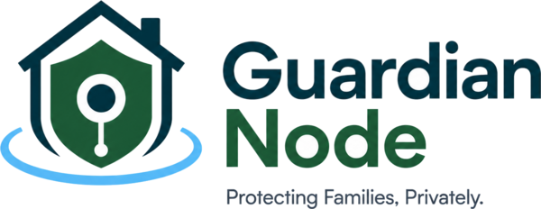

---
hide:
  - navigation
  - toc
---

# GuardianNode { .gn-hidden-title }

<div class="gn-hero" markdown>



<p class="gn-tagline">
An alpha/developer-preview safety monitor for families that runs on hardware you
own. Local AI helps parents review risk signals from a child's Windows device:
screenshots, OCR, vision/text classification, encrypted local evidence, and a
parent dashboard.
</p>

[Install on one PC](PARENT_GUIDES/install-on-one-pc.md){ .md-button .md-button--primary }
[Server + child PC](PARENT_GUIDES/install-server-and-child.md){ .md-button }
[Known limitations](https://github.com/the-vibe-dev/guardiannode/blob/main/KNOWN_LIMITATIONS.md){ .md-button }
[Support development](SUPPORT.md){ .md-button }

</div>

<div class="gn-cards" markdown>
<div class="gn-card" markdown>
<h3>🔒 Private by Design</h3>
<p>By default, your child's data stays on hardware you control. Classification runs on local AI (Ollama); external notifications are optional and parent-configured, and retained evidence is encrypted for parent review.</p>
</div>
<div class="gn-card" markdown>
<h3>👨‍👩‍👧 Family First</h3>
<p>Built for parents, not IT departments. Pairing uses a 6-digit code and an explicit server URL, and alerts explain what happened and what to do next.</p>
</div>
<div class="gn-card" markdown>
<h3>🤝 Trustworthy</h3>
<p>No stealth mode, ever. A visible tray icon shows the child when monitoring is on. No raw keystroke capture, no password-field collection, and parent-controlled capture scope.</p>
</div>
<div class="gn-card" markdown>
<h3>🧠 Technical & Modern</h3>
<p>Vision LLM reads the screen the way a person would — text and imagery — backed by a deterministic rules engine that works even when the model is down.</p>
</div>
<div class="gn-card" markdown>
<h3>💚 Calm & Supportive</h3>
<p>Severity-ranked alerts with per-category playbooks. It will miss things and sometimes false-alarm — we say so plainly. It's one tool, not a replacement for parenting.</p>
</div>
</div>

## How it works

<div class="gn-flow">
<b>Child PC agent</b> → <b>visible screen screenshots</b> → <b>your own server</b> → <b>local AI + rules</b> → <b>encrypted evidence</b> → <b>parent dashboard alert</b>
</div>

The agent on the child's PC reviews visible screen content from the configured
Windows session. Current installer defaults enable visible desktop screenshot
capture; policy/config can narrow capture to configured apps. Frames go to
**your** backend — the same PC or another machine in your house — where local
models and rules classify risk signals. Retained evidence is stored locally and
encrypted for parent review.

Read the full [architecture](ARCHITECTURE.md), [safety boundaries](SAFETY_BOUNDARIES.md), and [threat model](THREAT_MODEL.md).

## What do I need to run it?

The installer checks your hardware and picks the strongest tier it can run:

| Tier | Hardware | What it catches |
|---|---|---|
| **Full** | NVIDIA GPU with 16+ GB VRAM | Everything, with the most nuance on ambiguous chat |
| **Vision** *(default)* | NVIDIA GPU with 6–12 GB VRAM | Explicit imagery + grooming/self-harm/scam text + your custom watch phrases |
| **Text-only** | Any PC with 8 GB RAM, no GPU | Text risks only — visual-only content (nudity/gore without text) is **not** detected |

No GPU in the kid's PC? Use the [two-machine setup](PARENT_GUIDES/install-server-and-child.md): the child's PC runs only the lightweight agent and a Linux or Windows box with a GPU does the AI work.

## Install

**Everything on one Windows PC:**

1. Download `GuardianNodeChildSetup-0.1.0-alpha.1.exe` from the [latest release](https://github.com/the-vibe-dev/guardiannode/releases)
2. Pick **"Install everything on this PC"** — it detects your hardware and pulls the AI model (5–20 min)
3. The dashboard opens; create your parent password and **write down the 12-word recovery code**

**Linux server:**

```bash
curl -fsSL https://raw.githubusercontent.com/the-vibe-dev/guardiannode/main/installer/server-linux/install.sh | sudo bash
```

Then on the child's PC, get a pairing code from the dashboard (**Devices → Add device**) and run the installer with **"Connect to existing server"**.

Fresh servers bind to `127.0.0.1` and require the one-time setup token printed by
the installer or stored in the server token file. Complete first-run setup on
the server, then follow the manual LAN binding/firewall steps in the server +
child guide before pairing another PC.

Step-by-step with screenshots: [one PC](PARENT_GUIDES/install-on-one-pc.md) · [server + child PC](PARENT_GUIDES/install-server-and-child.md) · [troubleshooting](PARENT_GUIDES/troubleshooting.md)

## Guides

<div class="gn-cards" markdown>
<div class="gn-card" markdown>
<h3>Getting started</h3>
<p><a href="PARENT_GUIDES/install-on-one-pc/">Install on one PC</a> · <a href="PARENT_GUIDES/install-server-and-child/">Server + child PC</a> · <a href="PARENT_GUIDES/when-windows-says-protected-your-pc/">The Windows SmartScreen warning</a></p>
</div>
<div class="gn-card" markdown>
<h3>Everyday use</h3>
<p><a href="PARENT_GUIDES/pause-monitoring-when-you-use-the-pc/">Pause monitoring when you use the PC</a> · <a href="PARENT_GUIDES/if-you-forget-your-password/">If you forget your password</a> · <a href="PARENT_GUIDES/move-server-to-another-pc/">Move the server</a></p>
</div>
<div class="gn-card" markdown>
<h3>Honest limits</h3>
<p><a href="PARENT_GUIDES/what-this-cannot-stop/">What this cannot stop</a> — phones, school devices, in-person contact. Read this one first.</p>
</div>
<div class="gn-card" markdown>
<h3>For developers</h3>
<p><a href="BACKEND_SETUP/">Backend setup</a> · <a href="AGENT_WINDOWS/">Windows agent</a> · <a href="DASHBOARD/">Dashboard</a> · <a href="https://github.com/the-vibe-dev/guardiannode/blob/main/CONTRIBUTING.md">Contributing</a></p>
</div>
<div class="gn-card" markdown>
<h3>Project support</h3>
<p><a href="ROADMAP/">Roadmap</a> · <a href="SUPPORT/">Donations</a>. GuardianNode stays local-first, open-source, and subscription-free.</p>
</div>
</div>

!!! warning "GuardianNode is assistive software"
    It is not a replacement for parenting, professional support, or emergency services.
    It will miss things. It will sometimes false-alarm. Use it as one of several tools —
    and read [what it cannot stop](PARENT_GUIDES/what-this-cannot-stop.md).

<div class="gn-hero" markdown>
<small>
[Privacy](https://github.com/the-vibe-dev/guardiannode/blob/main/PRIVACY.md) ·
[Security policy](https://github.com/the-vibe-dev/guardiannode/blob/main/SECURITY.md) ·
[Code of conduct](https://github.com/the-vibe-dev/guardiannode/blob/main/CODE_OF_CONDUCT.md) ·
[Support development](SUPPORT.md) ·
AGPL-3.0 licensed
</small>
</div>
